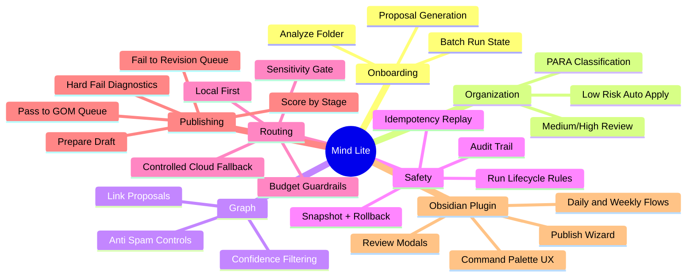

# Mind Lite

Local-first, Obsidian-native second brain automation with safety-first execution and editorially gated publishing.

**Status:** Active implementation (Phases A-F delivered)  
**API Runtime:** `http://127.0.0.1:8000`  
**Primary Surfaces:** Python API + Obsidian plugin

---

## What Mind Lite Does

Mind Lite helps you turn a large, messy Obsidian vault into something operational without giving up control.

- Analyze vault folders in batches
- Auto-apply low-risk improvements
- Send structural or risky changes to review
- Propose and apply graph links with anti-spam controls
- Route AI work local-first
- Publish to GOM only after stage-aware editorial gate checks

This project is intentionally built to be both useful and portfolio-ready: it demonstrates policy-driven AI workflows, safe automation, and testable behavior under failure and retry conditions.

---

## How It Works (Mindmap)



---

## Core Guarantees

- **Local-first by default:** model routing prefers local runtime
- **Policy before action:** sensitivity + budget + lifecycle checks gate execution
- **Human control for risky changes:** structural edits are not silently forced
- **Reversible operations:** snapshot + rollback support for apply flows
- **Editorial quality gate:** publish is blocked unless stage threshold and hard-fail rules pass

---

## Quick Start

### 1) Clone and install backend

```bash
git clone https://github.com/TorusSynth/Mind-Lite.git
cd Mind-Lite
python3 -m venv .venv
source .venv/bin/activate
pip install -e .
```

Optional dev tools:

```bash
pip install -e ".[dev]"
```

### 2) Start API server

```bash
PYTHONPATH=src python3 -m mind_lite.api
```

Expected:

```text
Mind Lite API listening on http://127.0.0.1:8000
```

### 3) Build Obsidian plugin

```bash
cd obsidian-plugin
npm install
npm run build
```

### 4) Install plugin into your vault

Copy these files to:

`<your-vault>/.obsidian/plugins/mind-lite/`

- `obsidian-plugin/main.js`
- `obsidian-plugin/manifest.json`
- `obsidian-plugin/styles.css`

Then enable the plugin in Obsidian Community Plugins.

---

## Plugin Commands

- `Mind Lite: Analyze Folder`
- `Mind Lite: Review Proposals`
- `Mind Lite: Apply Approved`
- `Mind Lite: Rollback Last Batch`
- `Mind Lite: Propose Links`
- `Mind Lite: Apply Links`
- `Mind Lite: Daily Triage`
- `Mind Lite: Weekly Deep Review`
- `Mind Lite: Publish to GOM`

---

## Manual Test Pass Guide

Use the full step-by-step manual here:

- `docs/MANUAL_TEST_PASS.md`

It includes:

- installation checklist
- end-to-end command walkthrough
- publish gate pass/fail scenarios
- expected outputs and acceptance criteria

---

## Verification Commands

Backend:

```bash
PYTHONPATH=src python3 -m unittest discover -q
```

Plugin:

```bash
cd obsidian-plugin
npm run verify
```

---

## Technical Snapshot

- API service: `src/mind_lite/api/service.py`
- HTTP routing: `src/mind_lite/api/http_server.py`
- Obsidian plugin entry: `obsidian-plugin/src/main.ts`
- Publish flow client logic: `obsidian-plugin/src/features/publish/gom-flow.ts`
- API contracts and examples: `API.md`
- Architecture boundaries: `ARCHITECTURE.md`
- Capability roadmap: `ROADMAP.md`

---

## Portfolio Framing

Mind Lite demonstrates:

- policy-based AI system design
- reliable stateful workflow execution
- idempotent/replay-safe endpoint behavior
- reversible automation with human review boundaries
- product-facing UX over strict backend contracts

If you are evaluating this project as an engineering portfolio, start with:

1. `README.md`
2. `docs/MANUAL_TEST_PASS.md`
3. `API.md`
4. `ARCHITECTURE.md`
