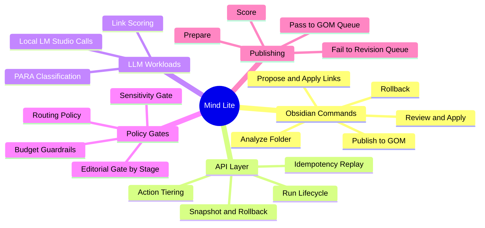

# Mind Lite

Mind Lite is a local-first automation layer for Obsidian that helps you organize notes, rebuild useful graph links, and publish through a strict editorial gate.

**Status:** Active implementation (Phases A-F complete)  
**Runtime API:** `http://127.0.0.1:8000`  
**Primary interfaces:** Python API + Obsidian plugin

---

## What You Can Do With It

- Analyze an existing vault folder and generate action-tiered proposals
- Auto-apply safe changes while keeping risky changes in review
- Propose/apply note links with confidence controls and anti-spam guards
- Run daily triage and weekly deep review from Obsidian command palette
- Publish drafts through stage-aware quality gates (`seed`, `sprout`, `tree`)
- Route failed publish attempts to a revision queue with explicit reasons

---

## How It Works (Mindmap)



---

## Engineering Stack and Design Choices

- **Backend:** Python 3.10+, `http.server`-based local API, contract-oriented service logic
- **Plugin:** TypeScript Obsidian plugin (command-first, modal-driven UX)
- **Transport:** JSON-over-HTTP across plugin and API
- **Reliability:** run lifecycle validation, idempotency replay ledgers, snapshot/rollback semantics
- **Policy model:** explicit modules for routing, sensitivity, budget, and publish-gate enforcement
- **Testing:** backend `unittest` suite + plugin command/flow tests via Node scripts

Key implementation anchors:

- `src/mind_lite/api/service.py`
- `src/mind_lite/api/http_server.py`
- `obsidian-plugin/src/main.ts`
- `obsidian-plugin/src/features/publish/gom-flow.ts`

---

## Install and Configure

### 1) Clone and install backend

```bash
git clone https://github.com/TorusSynth/Mind-Lite.git
cd Mind-Lite
python3 -m venv .venv
source .venv/bin/activate
pip install -e .
```

Optional dev dependencies:

```bash
pip install -e ".[dev]"
```

### 2) Run the API

```bash
PYTHONPATH=src python3 -m mind_lite.api
```

Expected log:

```text
Mind Lite API listening on http://127.0.0.1:8000
```

### 3) Build and install Obsidian plugin

```bash
cd obsidian-plugin
npm install
npm run build
```

Copy into your vault plugin folder:

- `obsidian-plugin/main.js`
- `obsidian-plugin/manifest.json`
- `obsidian-plugin/styles.css`

Destination:

- `<your-vault>/.obsidian/plugins/mind-lite/`

Then enable **Mind Lite** in Obsidian Community Plugins.

---

## LLM Setup (Implemented Today)

Mind Lite currently uses an OpenAI-compatible local endpoint for LLM tasks (classification/link scoring).

### Local LLM with LM Studio

1. Start LM Studio local server
2. Ensure endpoint is available at:
   - `http://localhost:1234/v1/chat/completions`
3. Load any model in LM Studio and keep server running

Mind Lite calls this endpoint for:

- PARA classification (`organize/classify_llm.py`)
- Link scoring (`links/propose_llm.py`)

### External provider note

Routing policies include cloud fallback concepts (for example `openai` routing decisions), but this repository currently documents and supports the local LM Studio path as the concrete setup flow.

---

## Human Example: First Real Session

Imagine you have a folder `Projects/Atlas` with mixed notes, weak tags, and broken linking.

1. Open command palette -> `Mind Lite: Analyze Folder`
   - input: `Projects/Atlas`
   - result: run id + state returned in modal

2. Run `Mind Lite: Review Proposals`
   - inspect grouped proposals by status/risk

3. Run `Mind Lite: Apply Approved`
   - safe approved changes apply

4. Run `Mind Lite: Propose Links`
   - enter source note id and candidate note ids
   - review sorted suggestions by confidence

5. Run `Mind Lite: Apply Links`
   - optionally set minimum confidence (for example `0.70`)

6. Run `Mind Lite: Publish to GOM`
   - enter draft data + stage (`seed`, `sprout`, or `tree`)
   - if gate passes -> draft is queued for GOM
   - if gate fails -> draft is routed to revision queue with hard-fail reasons and recommended actions

---

## Full Manual Test Pass

For complete installation, command-by-command manual QA, and acceptance criteria:

- `docs/MANUAL_TEST_PASS.md`

---

## Verification Commands

Backend:

```bash
PYTHONPATH=src python3 -m unittest discover -q
```

Plugin:

```bash
cd obsidian-plugin
npm run verify
```

---

## Documentation Map

- `API.md` - endpoint contracts and payload examples
- `ARCHITECTURE.md` - component boundaries and system behavior
- `ROADMAP.md` - capability progression
- `docs/MANUAL_TEST_PASS.md` - full manual testing guide
